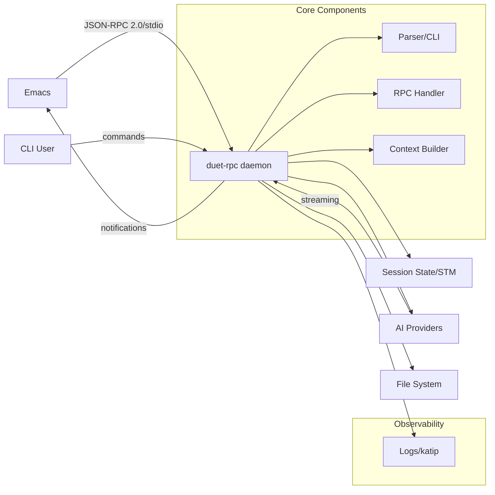

# Technical Architecture: duet-rpc

## Overview

`duet-rpc` is a Haskell-based RPC tool serving as the backend for AI-assisted development in Emacs. It operates in a hybrid model with both daemon mode for Emacs integration and one-shot CLI commands for scripting.

For detailed architecture decisions and rationale, see [decision-log/adr-log.md](decision-log/adr-log.md).

## System Architecture



## Key Architecture Decisions

### Process Model
- **Hybrid architecture**: Daemon for Emacs (low latency) + one-shot CLI commands (scripting)
- **Concurrency**: Green threads with STM for safe state management
- **Single session**: Queue/reject concurrent requests for simplicity

### Communication
- **Protocol**: JSON-RPC 2.0 over stdio with LSP-style length-prefixed framing
- **Streaming**: Progress notifications for AI token streaming
- **Batching**: 100ms update intervals for smooth Emacs UI

### Technology Stack
- **Language**: Haskell with GHC 9.10
- **Build**: Cabal with freeze files for reproducibility
- **Core Libraries**:
  - CLI: optparse-applicative
  - JSON: aeson + deriving-aeson
  - Logging: katip (structured)
  - HTTP: req (for AI providers)
  - Concurrency: async + STM
  - Config: tomland (TOML)

### Data & State
- **Runtime state**: STM with TVar/TMVar for concurrent safety
- **Persistence**: JSON files in XDG directories
- **Configuration**: TOML with validation phase
- **Backups**: Timestamped .bak files before modifications

### Safety & Security
- **File operations**: Dry-run with confirmation, path canonicalization, jail to project root
- **Error handling**: Typed ADTs everywhere for explicit, safe error handling
- **Credentials**: Environment variables only (standard practice)
- **Process recovery**: Auto-restart with exponential backoff

### Quality
- **Testing**: Property tests (QuickCheck) for core logic, unit tests for integration (tasty framework)
- **Linting**: hlint + ormolu for consistent code
- **Logging**: Four levels (error, warn, info, debug) with --debug flag for RPC dumps

## Non-Functional Requirements

### Performance Targets
- RPC ping latency: <100ms
- Context assembly: <500ms
- Token streaming: Batched every ~100ms
- Simple commands: ~100ms response time

### Resource Limits
- Max file size: 1MB per file
- Total context: 10MB per request
- Memory budget: <500MB
- Concurrency: Single session only

### Reliability
- Auto-restart on crash with backoff
- Smart retry for transient errors (3x)
- Configurable timeout (60s default)
- No data loss via mandatory backups

## Implementation Structure

### Module Organization
```
src/
  DuetRpc/
    CLI/           -- optparse-applicative parsers
    RPC/           -- JSON-RPC handling
    Providers/     -- AI provider clients
    Context/       -- Context assembly
    Session/       -- Session management
    FileOps/       -- Safe file operations
    Config/        -- Configuration
    Logging/       -- Katip setup
    Types/         -- Shared types and errors
```

### Error Type Hierarchy
```haskell
data DuetError
  = ConfigError ConfigError
  | RPCError RPCError
  | ProviderError ProviderError
  | FileError FileError
  | SessionError SessionError
  deriving (Show, Eq)
```

### Configuration Precedence
1. Command-line flags
2. Environment variables
3. Project `.duet-rpc.toml`
4. User config (`~/.config/duet-rpc/config.toml`)
5. System defaults

## Quality Gates

- All architecture decisions documented and accepted
- NFR targets specified with measurable criteria
- Error handling strategy consistently applied
- Security considerations explicitly addressed
- Testing approach defined with framework choices
